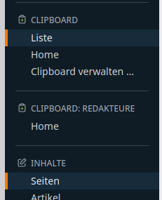
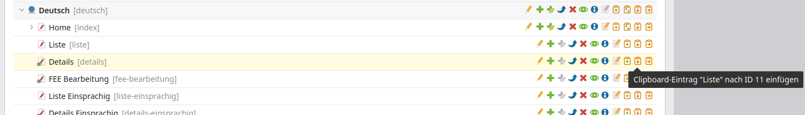
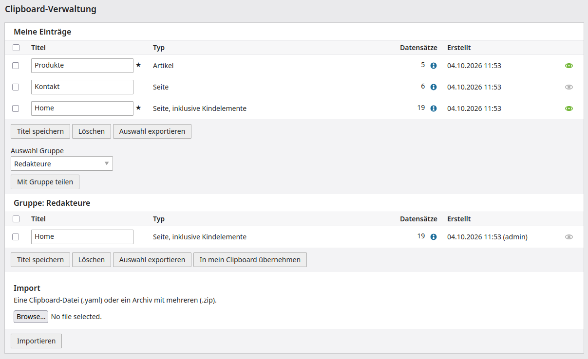
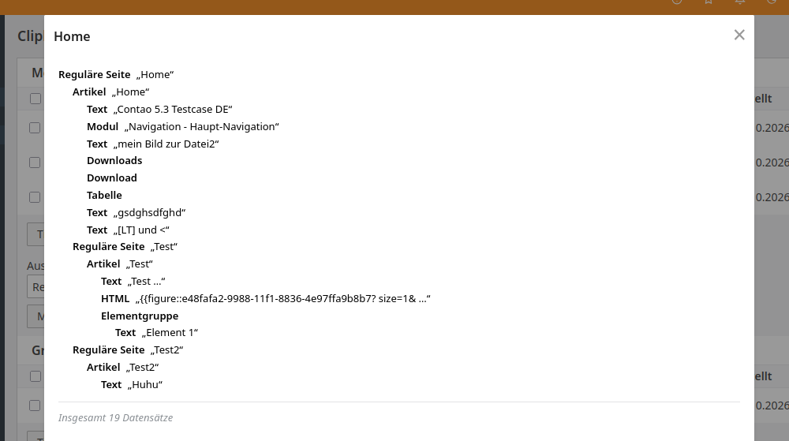

[](https://github.com/contao-community-alliance/contao-clipboard-bundle/actions)
[](https://github.com/contao-community-alliance/contao-clipboard-bundle/tags)
[](https://packagist.org/packages/contao-community-alliance/contao-clipboard-bundle)
[](https://packagist.org/packages/contao-community-alliance/contao-clipboard-bundle)

# Contao Clipboard

> **Preview des Fundraising-Standes.** Der Code ist zurzeit noch nicht öffentlich erreichbar und wird erst nach Ablauf
> des Fundraisings freigegeben. Bei Fragen zum Fundraising bitte E-Mail an zonky2 <info@e-spin.de>.
>
> **Preview of the fundraising state.** The code is not publicly available at the moment and will be released after the
> end of the fundraising. For questions about the fundraising please send an e-mail to zonky2 <info@e-spin.de>.

**Deutsch** | [English below](#english)

## Deutsch

### Über die Erweiterung

Das Clipboard speichert Seiten, Artikel, Inhaltselemente (auch die von News, Events und anderen Erweiterungen),
Frontend-Module, Formulare und Formularfelder für längere Zeit und fügt sie bei Bedarf wieder ein. Damit lassen sich
auch leicht vorgefertigte Zusammenstellungen exportieren und per Import in andere Installationen übertragen.

* Die Einträge stehen im Backend in der Navigation, in einer Gruppe wie bei den Favoriten. Sie sind kontextbezogen:
  Ein Backend-Modul zeigt die Einträge der Tabellen, die es selbst verwaltet. Bei den Seiten stehen die Seiten, bei
  den Artikeln die Artikel und Inhaltselemente, bei News auch die Inhaltselemente, bei den Formularen die Formulare
  und Formularfelder. In Modulen ohne solche Datensätze (zum Beispiel den Einstellungen) fehlt die Gruppe ganz.
* Ein Klick macht einen Eintrag zum aktiven. Je Typ (Seite, Artikel, Inhaltselement, Modul) kann ein Eintrag aktiv
  sein, er wird von den Einfügen-Buttons dieses Typs verwendet. Ein weiterer Klick auf den aktiven Eintrag
  deaktiviert ihn wieder, dann verschwinden die Einfügen-Buttons. Der Tooltip der Einfügen-Buttons nennt den Eintrag.
* Jede Liste dieser Datensätze hat Buttons, um einen Datensatz in das Clipboard zu kopieren und den aktiven Eintrag
  dahinter einzufügen (Seiten auch hinein, Formulare und Formularfelder samt Feldern bzw. in das Formular). Ausgewählte Datensätze lassen sich als
  Gruppe kopieren.
* Einträge lassen sich mit Benutzergruppen teilen. Jedes Mitglied darf sie verwenden. Wer das Recht "Clipboard-Einträge
  teilen" in der Benutzergruppe hat, darf sie anlegen, umbenennen und löschen.
* Die Verwaltung unter *System* listet die Einträge und benennt sie um, löscht, teilt, exportiert und importiert sie.

Die Einträge liegen als YAML-Dateien in `var/clipboard/user/<ID des Benutzers>/` und `var/clipboard/group/<ID der
Gruppe>/`. Sie sind lesbar und lassen sich mit Export und Import der Verwaltung in eine andere Installation
übertragen (eine Datei oder, für mehrere Einträge, ein ZIP-Archiv).

### Systemvoraussetzungen

* PHP 8.3 oder höher
* Contao 5.3 bis 5.7

### Installation und Einrichtung

Im Contao Manager nach "Clipboard" suchen und installieren, oder per Composer:

`$ composer require contao-community-alliance/contao-clipboard-bundle`

Danach in den Benutzerprofilen das Clipboard aktivieren (Feld "Clipboard verwenden"). Zum Teilen mit einer Gruppe
bekommt die Benutzergruppe das Recht "Clipboard-Einträge teilen".

Das Verzeichnis der Einträge lässt sich mit dem Parameter `cca_clipboard.directory` ändern.

### Aufräumen

Wird ein Benutzer oder eine Benutzergruppe gelöscht, werden auch ihre Clipboard-Einträge gelöscht. Bei einer Gruppe
verschwinden damit die Einträge, die mit ihr geteilt wurden. Wer sie weiter braucht, hat sie vorher in sein eigenes
Clipboard übernommen.

Für Einträge, die darüber nicht erfasst wurden (zum Beispiel nach dem Löschen direkt in der Datenbank), gibt es einen
Befehl:

```
$ php vendor/bin/contao-console cca-clipboard:cleanup --dry-run   # zeigt nur, was entfernt würde
$ php vendor/bin/contao-console cca-clipboard:cleanup
```

Er lässt sich auch regelmäßig per Cron aufrufen.

### Icons

Die Icons sind den Clipboard-Icons von [Lucide](https://lucide.dev) nachempfunden (ISC-Lizenz, siehe
`public/icons/LICENSE-lucide.txt`). Das ist der Stil, den Contao seit 5.7 für die Backend-Icons verwendet.

### Erweitern

**Eigene Tabellen anmelden.** Ein Service, der `ContaoCommunityAlliance\ClipboardBundle\Table\TableProviderInterface`
implementiert, wird automatisch erkannt (Tag `cca_clipboard.table_provider`) und liefert `TableDefinition`-Objekte:

```php
use ContaoCommunityAlliance\ClipboardBundle\Table\TableDefinition;
use ContaoCommunityAlliance\ClipboardBundle\Table\TableProviderInterface;

class MyTables implements TableProviderInterface
{
    public function tables(): iterable
    {
        // Positionen gehören zu einer Bestellung und werden mit ihr kopiert
        yield new TableDefinition('tl_my_order', root: true, children: ['tl_my_item'], titleFields: ['number']);
        yield new TableDefinition('tl_my_item', parents: ['tl_my_order'], titleFields: ['name']);
    }
}
```

Die Tabelle erhält die Buttons in den Listen des Backend-Moduls, das sie in seinen `tables` führt, die Einträge in der
Navigation, das Einfügen und die Verwaltung. Mehrere Definitionen derselben Tabelle werden zusammengeführt, so kann eine
Erweiterung einer fremden Tabelle einen Elternteil ergänzen. Die Eltern der Inhaltselemente (`tl_content`) werden wie
in Contao aus den `ctable` der DCAs gefunden, News, Events und eigene Eltern funktionieren also ohne Zutun.

**Events** statt der alten Hooks (Version 1 und 2):

* `ContaoCommunityAlliance\ClipboardBundle\Event\ContentTitleEvent`: Titel für einen Inhaltselement-Typ liefern
* `ContaoCommunityAlliance\ClipboardBundle\Event\RecordCollectedEvent`: beim Kopieren, die Felder eines Datensatzes ändern
* `ContaoCommunityAlliance\ClipboardBundle\Event\PrepareRecordEvent`: vor dem Einfügen, Felder ändern oder den Datensatz
  überspringen (mit seinen Kindern)
* `ContaoCommunityAlliance\ClipboardBundle\Event\RecordPastedEvent`: nach dem Anlegen eines Datensatzes durch Einfügen
* `ContaoCommunityAlliance\ClipboardBundle\Event\RecordsPastedEvent`: nach dem Einfügen einer Gruppe

Die Bezeichnung des Typs in der Navigation und der Verwaltung kommt aus `MSC.clipboardType_<Tabelle>`.

### Ursprüngliche Idee von MAN AT WORK GmbH

Danke für die erste Version des Contao Clipboards. Mehr zu MAW: https://www.men-at-work.de/

### Screenshots

Die Navigation mit dem eigenen Clipboard und dem der Gruppe "Redakteure". Der aktive Eintrag ist markiert:



Die Buttons einer Seitenliste. Der Tooltip der Einfügen-Buttons nennt den aktiven Eintrag:



Die Clipboard-Verwaltung unter "System": Umbenennen, Aktivieren (Auge), Löschen, Exportieren, Teilen mit Gruppen und Import. Die Zahl zeigt alle Datensätze eines Eintrags:



Das (i)-Icon neben der Zahl öffnet den Inhalt des Eintrags als Baum mit Typ und Titel:



## English

[Deutsch oben](#deutsch)

### About

The clipboard extension offers the possibility to store pages, articles, content elements (also those of news,
events and other extensions), frontend modules, forms and form fields in a clipboard for an extended time-period and
to paste them again. With it, prepared compositions can also be easily exported and transferred to other
installations by import.

* The entries of the clipboard are listed in the navigation of the backend, in a group like the favorites. They
  depend on the context: a backend module shows the entries of the tables it manages itself. With the pages those of
  pages, with the articles those of articles and content elements, with news also the content elements, with the forms
  those of forms and form fields. The group is missing in modules without such records (e.g. the settings).
* A click on an entry makes it the active one. One entry per type (page, article, content element, module) can be
  active, and it is used by the paste buttons of this type. Another click on the active entry deactivates it, then
  the paste buttons disappear. The tooltip of the paste buttons names the entry.
* Every list of these records has the buttons to copy a record to the clipboard and to paste the active entry behind
  it (pages also into it, forms with their fields and form fields into a form). Selected records can be copied as a group.
* Entries can be shared with user groups. Every member may use them. Those who have the permission "Share clipboard
  entries" in the user group may create, rename and delete them.
* The administration under *System* lists the entries and renames, deletes, shares, exports and imports them.

The entries are stored as YAML files in `var/clipboard/user/<user id>/` and `var/clipboard/group/<group id>/`.
They are readable and can be transferred to another installation with the export and import of the
administration (a file, or a ZIP archive for several entries).

### System requirements

* PHP 8.3 or higher
* Contao 5.3 to 5.7

### Installation & Configuration

Typing in Contao Manager "Clipboard" and install or use composer

`$ composer require contao-community-alliance/contao-clipboard-bundle`

Then enable the clipboard for the users in their profile (field "Enable clipboard"). To share entries with a group,
give the user group the permission "Share clipboard entries".

The directory of the entries can be changed with the parameter `cca_clipboard.directory`.

### Cleaning up

When a user or a user group is deleted, its clipboard entries are deleted with it. For a group these are the entries
which have been shared with it. Those who still need them have adopted them into their own clipboard before.

For entries this did not catch (for example after a deletion directly in the database) there is a command:

```
$ php vendor/bin/contao-console cca-clipboard:cleanup --dry-run   # only lists what would be removed
$ php vendor/bin/contao-console cca-clipboard:cleanup
```

It can also be called regularly with cron.

### Icons

The icons are drawn after the clipboard icons of [Lucide](https://lucide.dev) (ISC license, see
`public/icons/LICENSE-lucide.txt`), which is the style Contao uses for its backend icons since 5.7.

### Extending

**Register your own tables.** A service which implements `ContaoCommunityAlliance\ClipboardBundle\Table\TableProviderInterface`
is picked up automatically (tag `cca_clipboard.table_provider`) and returns `TableDefinition` objects:

```php
use ContaoCommunityAlliance\ClipboardBundle\Table\TableDefinition;
use ContaoCommunityAlliance\ClipboardBundle\Table\TableProviderInterface;

class MyTables implements TableProviderInterface
{
    public function tables(): iterable
    {
        // The items belong to an order and are copied along with it
        yield new TableDefinition('tl_my_order', root: true, children: ['tl_my_item'], titleFields: ['number']);
        yield new TableDefinition('tl_my_item', parents: ['tl_my_order'], titleFields: ['name']);
    }
}
```

The table gets the buttons in the lists of the backend module which has it in its `tables`, the entries in the
navigation, the pasting and the administration. Several definitions of the same table are merged, so an extension can
add a parent to a table of someone else. The parents of the content elements (`tl_content`) are found in the `ctable`
of the DCAs, like Contao does it. News, events and parents of your own work without further ado.

**Events** instead of the old hooks (version 1 and 2):

* `ContaoCommunityAlliance\ClipboardBundle\Event\ContentTitleEvent` to provide the title of a content element type
* `ContaoCommunityAlliance\ClipboardBundle\Event\RecordCollectedEvent` when copying, to change the fields of a record
* `ContaoCommunityAlliance\ClipboardBundle\Event\PrepareRecordEvent` before pasting, to change the fields or to skip
  the record (with its children)
* `ContaoCommunityAlliance\ClipboardBundle\Event\RecordPastedEvent` after a record has been created by pasting
* `ContaoCommunityAlliance\ClipboardBundle\Event\RecordsPastedEvent` after a group has been pasted

The name of the type in the navigation and the administration comes from `MSC.clipboardType_<table>`.

### Original idea by MAN AT WORK GmbH

Thanks for the first version of the Contao Clipboard. More to MAW https://www.men-at-work.de/

### Screenshots

The navigation with the own clipboard and the one of the group "Redakteure". The active entry is marked:


The buttons of a list of pages. The tooltip of the paste buttons names the active entry:


The clipboard administration under "System": rename, activate (eye), delete, export, share with groups and import. The number shows all records of an entry:


The (i) icon next to the number opens the content of the entry as a tree with type and title:


